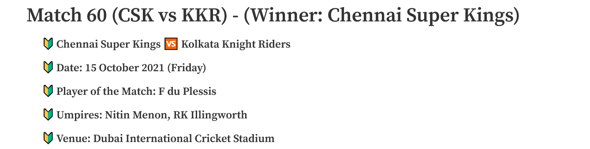
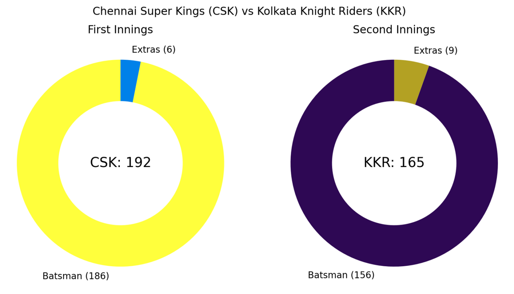
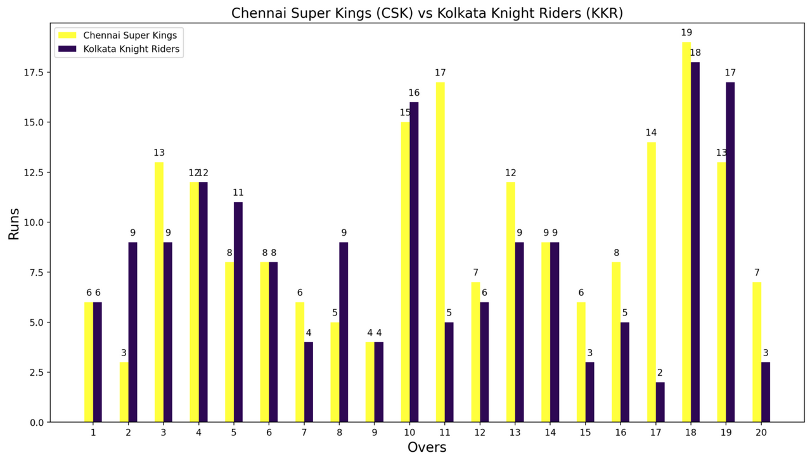
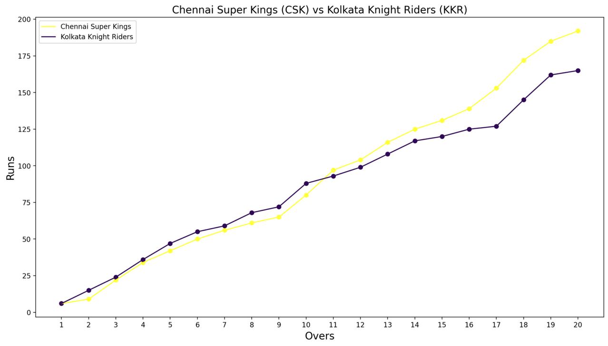
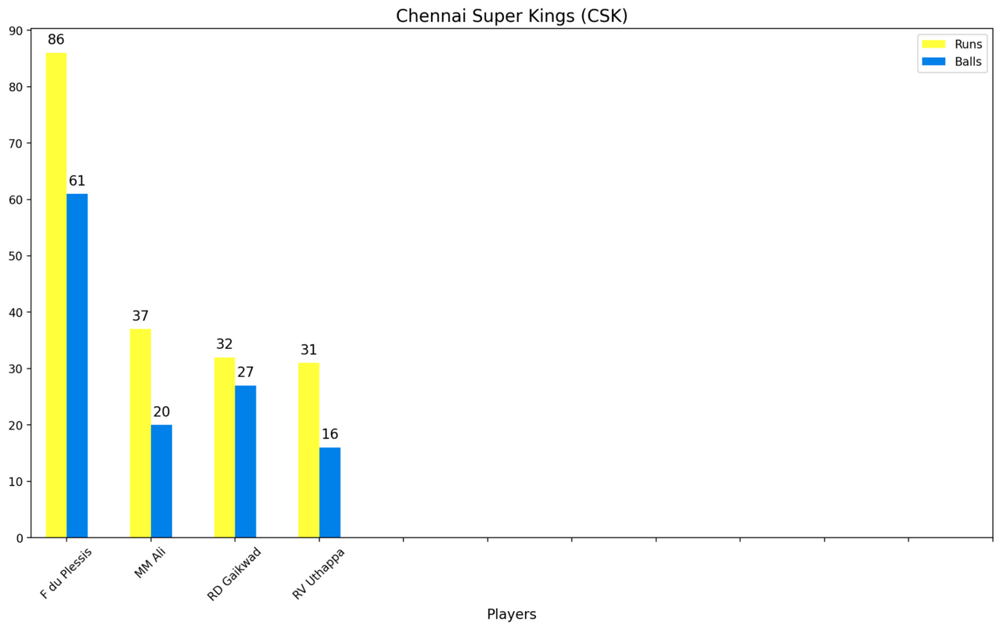
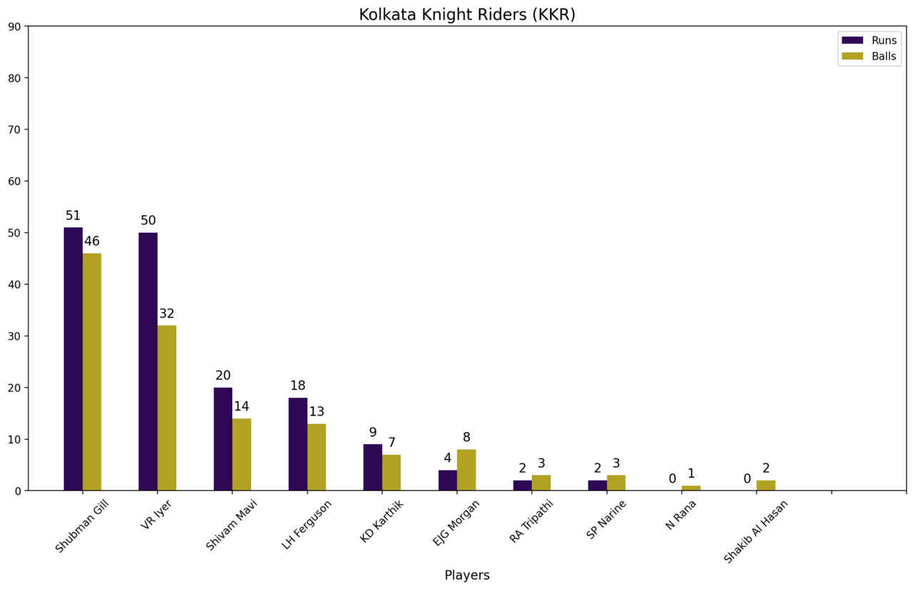

# 🏏 IPL 2021 - Interactive Match Dashboard

This project is a **Streamlit-based interactive web app** that provides a detailed analysis of **every match from the 2021 Indian Premier League (IPL)**. It enables users to explore team scores, run rates, and player performance with beautiful visualizations and dynamic selection tools.

---

## 🚀 Features

- 📊 Interactive analysis of all IPL 2021 matches
- 🏏 Team-wise and player-wise score visualizations
- 📈 Over-wise run rate charts (bar and line)
- 🥇 Player of the match, venue, umpires, and other key details
- 🎨 Stylish UI with custom CSS and theming

---

## 📂 Project Structure

```
IPL-2021/
├── app.py                  # Main Streamlit application
├── match.py                # Match class for visualizations
├── dataset/                # Match-level and point table CSVs
├── assets/                 # App icons, logos
├── styles/
│   └── main.css            # Custom CSS styling
├── config.toml             # Streamlit theme configuration
├── requirements.txt        # Python dependencies
├── .gitignore
└── README.md
```

---

## 🧱 Technology Stack

- **Streamlit** – for building the interactive web app
- **Pandas / NumPy** – for data manipulation
- **Matplotlib** – for plotting graphs
- **Pillow** – for image processing
- **Custom CSS + TOML** – for visual styling

---

## 🛠️ Setup Instructions

1. **Clone the repository**:
   ```bash
   git clone https://github.com/arabind-meher/IPL-2021.git
   cd IPL-2021
   ```

2. **Install dependencies**:
   ```bash
   pip install -r requirements.txt
   ```

3. **Run the Streamlit app**:
   ```bash
   streamlit run app.py
   ```

> 📝 The app reads match data from the `dataset/` folder and allows analysis of individual matches via sidebar inputs.

---

## 📸 Dashboard Preview

### 📝 Match Summary


### 🏏 Teams Score


### 📊 Runs per Over
**Bar Graph**  


**Line Graph**  


### 🧑‍💻 Teams Batting Score
**Team 1 (Chennai Super Kings)**  


**Team 2 (Kolkata Knight Riders)**  


---

## 📬 Contact

**Author:** Arabind Meher  
🔗 [LinkedIn](https://www.linkedin.com/in/arabind-meher)  
🔗 [GitHub](https://github.com/arabind-meher)

---

📌 _Note: Screenshots demonstrate the final match. The dashboard supports **dynamic match selection** for all IPL 2021 games._
